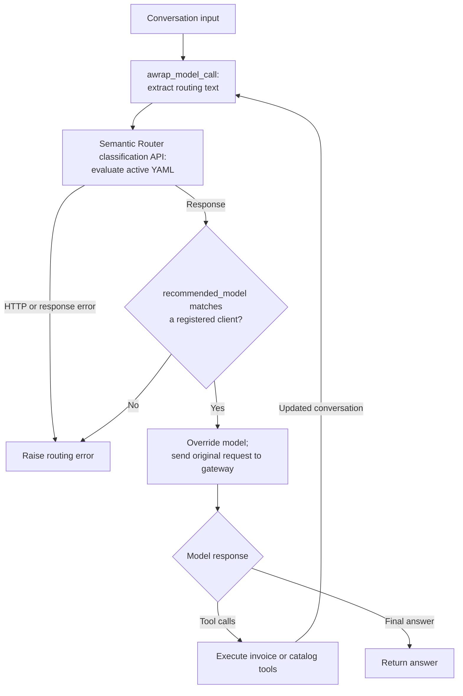

# Semantic Router music-store agent

This demo applies model routing to a music-store agent: **Semantic Router
classifies the request; YAML rules select a model; LangChain middleware applies
the selection; the selected model performs the work.** One agent shares the
same three tools across an efficient model and a more capable model.

| Request | Model | Work |
| --- | --- | --- |
| `Show my current invoices.` | `gpt-5.4-mini` | Retrieve invoice dates and totals. |
| `Compare available invoices for last three months and recommend the music based on those purchases.` | `gpt-5.6-luna` | Read invoice details, compare purchases, and find music in the catalog. |

These are the keyword baseline's intended routes. The embedding example matches
requests against representative phrases by meaning. Routing aims to balance
capability, cost and latency; measure answer quality and total request cost,
including classification overhead, before claiming an improvement.

## Execution flow

The Docker-hosted [`vllm-sr`](https://pypi.org/project/vllm-sr/0.3.0/) service
returns a model recommendation. LangChain calls the generation gateway directly.



[SemanticRouterMiddleware](middleware.py) runs before **every model invocation**,
including follow-ups after tool execution. It sends text from system, user and
assistant messages to the router; developer messages become system messages for
classification. Raw tool messages, tool-call arguments and tool definitions are
omitted. Assistant prose can still contain summaries of tool or customer data.

Only the model is overridden through `request.override(model=...)`. The selected
client receives the original system message, conversation, tools and complete
tool history. The two included routing signals use the latest user message, so
tool follow-ups normally retain its route, but each invocation is classified
again. There is no local route cache.

## Run

Use Python 3.14 and uv. From the repository root:

```bash
uv sync
cd semantic-router-agent
cp -n .env.example ../.env
```

[langgraph.json](langgraph.json) loads the repository-root `.env`. The copy
preserves an existing file; if one exists, add the required values manually.
Set `MODEL_GATEWAY_BASE_URL`, `OPENAI_API_KEY` and `CHINOOK_DB_PATH` for your
gateway and an existing Chinook SQLite database. The gateway is not bundled.
See [Configuration and troubleshooting](#configuration-and-troubleshooting)
for defaults and API requirements.

Choose one of the two standalone configurations; the agent and tools stay the
same. Start with embeddings, or use the keyword baseline without a routing model.

| Configuration | Signal | Local routing model |
| --- | --- | --- |
| [router-embeddings.yaml](router-embeddings.yaml) | Similarity to invoice and recommendation examples | CPU mmBERT embedding model |
| [router.yaml](router.yaml) | Case-insensitive keywords | None |

Have Docker running. The `vllm-sr==0.3.0` CLI manages containers using the matching
runtime image. From this demo directory:

```bash
ROUTER_CONFIG=router-embeddings.yaml
uv run vllm-sr validate --config "$ROUTER_CONFIG"
env -u OPENAI_API_KEY -u ANTHROPIC_API_KEY \
  uv run vllm-sr serve --config "$ROUTER_CONFIG" --minimal \
  --image ghcr.io/vllm-project/semantic-router/vllm-sr:v0.3.0
```

The `env -u` options omit any exported generation keys from this command because
the CLI otherwise passes them into Docker. They do not change your shell or
the environment file; LangGraph loads that file separately for the Python agent.

First startup downloads the image and, for embeddings, the 307M-parameter
`llm-semantic-router/mmbert-embed-32k-2d-matryoshka` model. Allow time and disk/RAM
for it. The CLI mounts this demo's `models/` directory at `/app/models`; the YAML
selects CPU inference with Candle, 768 dimensions and layer 22. No separate
embedding server or key is needed. Model downloads are not pinned to a Hugging
Face commit.

Minimal mode starts the router and unused Envoy without a dashboard/observability
stack. The agent uses the classification API on **port 8080**; port 8899 is
Envoy's generation proxy. Check readiness and model downloads with:

```bash
uv run vllm-sr status
uv run vllm-sr logs router
```

To switch to the keyword baseline, stop the router, then repeat the validation
and serve commands above with the new configuration. Run one example at a time:

```bash
uv run vllm-sr stop
ROUTER_CONFIG=router.yaml
```

Start the agent in another terminal, from this folder:

```bash
uv run langgraph dev --port 2025
```

The middleware and database tools are async: use Studio or `graph.ainvoke(...)`
when invoking the agent from Python.

In Studio select `semantic-router-agent` and supply this run context:

```json
{"customer_id": 44, "as_of": "2025-12-22"}
```

## Routing contract

The middleware and the active YAML have separate responsibilities:

| Area | Contract |
| --- | --- |
| Classification input | `{"messages": [...]}` containing the role/text projection described above. Runtime customer context is not a separate field in this request. |
| Endpoint | `POST /api/v1/classify/intent` on the configured router API. |
| Response | A JSON object with a nonempty string `recommended_model` matching a key in the Python model registry exactly. |
| Selection | Choose the registered client and override only the model on the original request. |
| Frequency | One classification request before every model invocation; no local routing retry or route cache. |
| No signal match | A successful YAML fallback decision selects `gpt-5.4-mini`. |
| Routing failure | HTTP/URL/JSON errors, missing selections and unknown model names raise `RuntimeError`; generation for that step does not start. |
| Timeout | The routing HTTP client uses a 30-second timeout per HTTP operation. There is no overall graph deadline in this middleware. |

The graph's initial mini client is not an outage fallback. Router failure stops
the model step; errors from the selected generation gateway propagate without
automatic failover to the other model.

In [router.yaml](router.yaml), the case-insensitive keywords are `compare`,
`recommend`, `recommendation`, `recommendations`, `analyze` and `analyse`.
A match selects `purchase-recommendations` at priority 100; the unconditional
`invoice-lookup` decision at priority 1 supplies the fallback.

In [router-embeddings.yaml](router-embeddings.yaml), each signal compares the
request with its candidate phrases using `aggregation_method: max` and a `0.7`
similarity threshold. `purchase-recommendations` has priority 100,
`invoice-lookup` has priority 90, and `default-efficient` has priority 1.
Higher-priority matching decisions take precedence. Soft matching is disabled,
so requests matching neither embedding signal can reach the fallback. Tune
these thresholds against representative requests; similarity is not a calibrated
probability of correctness.

The classification API uses the first model reference of the selected decision;
each included decision has exactly one. Generation-proxy plugins and advanced
selection among several model references do not run through this API workflow.

## Examples and verification

Use separate Studio threads with `customer_id: 44` and `as_of: "2025-12-22"`.
The table describes expected routes and tool work; embedding outcomes must be
checked against the running model and configuration.

| Active YAML | Prompt | Expected decision / model | Expected tool work |
| --- | --- | --- | --- |
| `router.yaml` | `Show my current invoices.` | `invoice-lookup` / mini | `list_my_invoices()`; report dates and totals. |
| `router.yaml` | `Compare available invoices for last three months and recommend the music based on those purchases.` | `purchase-recommendations` / luna | List the three-month window, read each invoice, then find catalog candidates. |
| `router.yaml` | `What should I listen to next based on my recent orders?` | `invoice-lookup` / mini; no baseline keyword matches | Recommendations still require purchase and catalog tools; routing does not restrict their availability. |
| `router-embeddings.yaml` | `Find my latest music-store receipt.` | `invoice-lookup` / mini | `list_my_invoices()` to find the receipt. |
| `router-embeddings.yaml` | `What should I listen to next based on my recent orders?` | Intended `purchase-recommendations` / luna | Inspect purchase history and catalog results. |
| `router-embeddings.yaml` | `Hello.` | `default-efficient` / mini **if neither embedding signal matches** | No account lookup is needed for a greeting. Confirm the fallback in the router output. |

Verify the stages separately:

1. **Classification:** inspect `recommended_model` in the API response and the
   decision/signal information available in router logs. `matched=true` alone
   does not establish which generation model ran.
2. **Model selection:** inspect the generation span in Studio or LangSmith for
   the selected model's name. The classification HTTP request is not automatically
   a LangSmith model span; no custom route/confidence/latency display is included.
3. **Tool work and answer:** for the three-month comparison, check
   `list_my_invoices(months=3)`, `get_invoice_details` for every returned invoice,
   then `popular_in_genre`. Verify the answer against those results, including
   purchase-history gaps and the reference date.

To inspect classification independently of generation, send a synthetic prompt
to the default local API. Adjust the URL if your router uses another address:

```bash
curl --fail --silent --show-error --max-time 30 \
  http://127.0.0.1:8080/api/v1/classify/intent \
  -H 'Content-Type: application/json' \
  -d '{"messages":[{"role":"user","content":"What should I listen to next based on my recent orders?"}]}'
```

This probe sends only the user message. The agent supplies the fuller text
projection described in the routing contract. A routing response alone does
not verify gateway generation, tool execution or answer quality.

For the sample database used by this demo, the three-month window is
22 September–22 December 2025, inclusive. Customer 44 has invoices **400** and
**411** in that window: 16 tracks totalling **$15.84**, with no October invoice.
Verify these fixture expectations against your configured database if you use
another Chinook copy. "Current invoices" means recorded purchases through the
reference date; Chinook has no paid/unpaid invoice status.

Earlier manual checks recorded a live embedding selection of
`purchase-recommendations` / `gpt-5.6-luna` for the recommendation paraphrase.
Mocked checks covered model selection, missing/unknown selections and the Luna
Responses tool-call round trip with encrypted reasoning history; earlier checks
also exercised read-only tools and model callbacks. These are historical
observations, not an included automated test suite or an accuracy benchmark.
Live gateway generation and delivery to LangSmith have not been verified here.

## Configuration and troubleshooting

The router and generation gateway are separate services. These are the code
defaults; example environment values may override them:

| Component | Variable | Default | Purpose |
| --- | --- | --- | --- |
| Router | `SEMANTIC_ROUTER_API_URL` | `http://127.0.0.1:8080` | Classification API base, without a `/v1` suffix. |
| Generation | `MODEL_GATEWAY_BASE_URL` | `http://127.0.0.1:4000/v1` | OpenAI-compatible gateway reachable from the Python agent. |
| Generation | `OPENAI_API_KEY` | Required; no default | Gateway credential; the middleware sends no generation key to the classifier. |
| Database | `CHINOOK_DB_PATH` | `chinook.db` relative to this demo directory | Existing Chinook SQLite file, opened read-only. A sibling repository's database requires an explicit path. |
| Tracing | `LANGSMITH_TRACING`, `LANGSMITH_API_KEY`, `LANGSMITH_PROJECT` | No application overrides | Configure standard LangChain model/tool traces through the SDK. |

Router YAML provider URLs are schema-required placeholders in this
classification-only workflow; generation uses `MODEL_GATEWAY_BASE_URL`.
Do not put gateway credentials in the YAML. The routing HTTP client uses
`trust_env=False`, so environment proxy settings are not applied to that client.
Restart the agent after changing its environment or model registry, and restart
the router after changing its active YAML.

The model clients are configured in [semantic-router-agent.py](semantic-router-agent.py):

| Model | Generation API | Client settings |
| --- | --- | --- |
| `gpt-5.4-mini` | Chat Completions (`/v1/chat/completions`) | Tool calling; `store=False`. |
| `gpt-5.6-luna` | Responses (`/v1/responses`) | Tool calling; `store=False`; requests `reasoning.encrypted_content` for reasoning history across tool calls. |

The gateway must expose those exact names and support each configured API with
tools. LangGraph carries the conversation and tool history. No reasoning-effort
setting is supplied; the gateway's defaults apply. See the
[reasoning-history guide](https://developers.openai.com/api/docs/guides/reasoning#preserve-reasoning-without-stored-responses)
for the Responses approach used by the Luna client.

| Observation | Interpretation and next check |
| --- | --- |
| `Semantic Router could not return a routing decision.` | Check Docker, model readiness, API URL/port 8080, HTTP errors and response JSON. Use `uv run vllm-sr status` and `uv run vllm-sr logs router`. |
| `Semantic Router returned no recommended_model.` | Check response shape, YAML `modelRefs` and fallback decisions. |
| `Semantic Router selected ... but the agent only has ...` | Match YAML references and Python registry names exactly, then restart the affected components. |
| Classification succeeds but generation fails | Check the gateway credential, model name and tool-calling support on the selected API. Routing does not test gateway health. |
| `Chinook database not found: ...` | Set `CHINOOK_DB_PATH` to an existing file; relative paths resolve from this demo directory. |
| Tool returns an `error` dictionary | Check customer ID, reference-date format and invoice availability for that customer/date. |
| Invoice or catalog results are empty | Check the reference date, purchase window and genre. An empty result is not a routing failure. |

**Model compatibility:** the included embedding configuration uses mmBERT.
Vela requires separate compatibility verification with the chosen image. Prior
source review identified position-scaling and pooling differences in v0.3.0;
this was not an observed Vela startup failure. References:
[Vela configuration](https://huggingface.co/llm-semantic-router/Vela-1.0-Encoder-307M-Domain/raw/main/config.json),
[domain loader](https://github.com/vllm-project/semantic-router/blob/v0.3.0/candle-binding/src/model_architectures/traditional/modernbert.rs#L818),
[embedding loader](https://github.com/vllm-project/semantic-router/blob/v0.3.0/candle-binding/src/model_architectures/embedding/mmbert_embedding.rs#L198).

## Tools, data and limitations

[UserContext](tools.py) supplies a positive integer `customer_id` and an `as_of`
date in `YYYY-MM-DD` format; the date defaults to `2025-12-22`. They come from
runtime context, not model-generated tool arguments. Conversation threads retain
message history; this demo has no long-term preference store. Use separate
threads when switching customers because their previous messages remain in the
conversation.

Both models receive the same tools. Account scoping is implemented inside those
tools and their SQL queries:

| Tool | Contract |
| --- | --- |
| `list_my_invoices(months=None)` | Lists the customer's invoices through `as_of`. Optional `months` is an integer from 1–12; the window subtracts that many months from `as_of`, with both endpoints included. Omitting it lists all recorded invoices through the date. |
| `get_invoice_details(invoice_id)` | Requires a positive integer ID. Returns tracks, artists, albums, genres and prices only for an invoice owned by the runtime customer and dated on/before `as_of`. |
| `popular_in_genre(genre, limit=5)` | Matches the genre case-insensitively; limit is an integer from 1–50. Excludes videos and tracks the customer already bought through `as_of`, and ranks candidates by recorded sales through that date. |

Integer tool arguments use strict schema validation. Invalid customer context
or unavailable invoices return error dictionaries; routing failures raise
exceptions. The database adapter uses parameterized SQL and read-only SQLite
connections, running queries off the event loop. It does not import the sibling
agent or modify the database.

The caller supplies the customer ID; no authentication is implemented. Routing
changes model choice and grants no account permissions. The router's
classification API also has no authentication configured. Keep its published
ports private; a loopback URL in the Python agent does not restrict Docker's
port bindings. Both YAMLs disable shared semantic caching, response storage,
replay and router tracing.

The included signals do not assess raw tool results, verify answer correctness,
or measure gateway availability. Fetching additional invoices does not itself
escalate the route. Each generation step adds classification latency, and there
is no automatic gateway failover or quality-based rerouting. The agent prompt
asks for grounded recommendations, but selecting a model does not guarantee
that it follows the expected tool sequence or produces a correct answer.

## Code map and extension points

| File | Responsibility |
| --- | --- |
| [semantic-router-agent.py](semantic-router-agent.py) | Creates model clients and exports `graph`; registers the middleware, tools, context and prompt. |
| [middleware.py](middleware.py) | Projects routing text, calls the classification API, validates the selected model and overrides the model request. |
| [router.yaml](router.yaml) | Defines the keyword baseline, decision priorities and efficient-model fallback. |
| [router-embeddings.yaml](router-embeddings.yaml) | Defines candidate phrases, similarity thresholds, priorities, fallback and local mmBERT configuration. |
| [tools.py](tools.py) | Defines runtime context and customer-scoped invoice/catalog tools. |
| [db.py](db.py) | Resolves the database path and runs read-only SQL queries off the event loop. |
| [langgraph.json](langgraph.json) | Registers the graph and repository-root environment file. |

To add a routing example, define signals, decisions and a fallback in a
standalone YAML, validate it with the pinned CLI, then restart the router.
To add a generation model, register a compatible tool-calling client in Python
and use the same name in the YAML provider/model references and gateway.
Restart the agent and router as needed, then verify classification, selected
model spans, tool work and answer quality separately.
