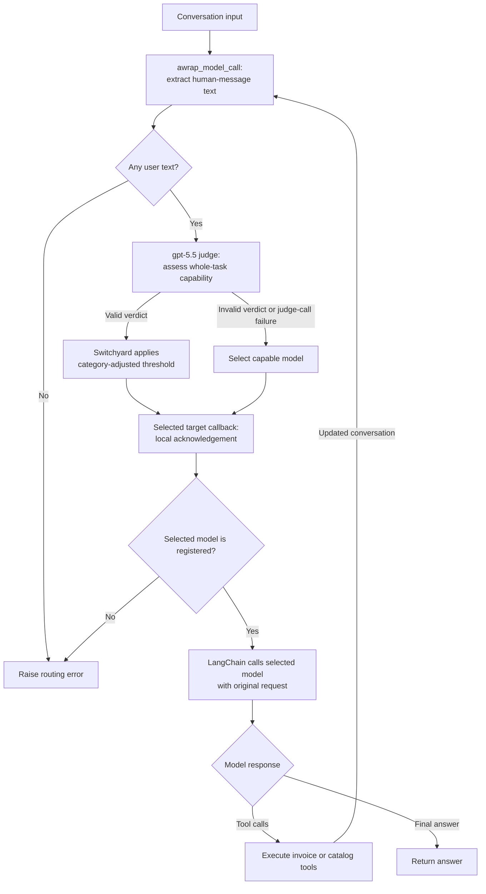

# Switchyard music-store agent

This demo applies capability-based model routing: **a judge estimates whether
the efficient agent can complete the task; NVIDIA Switchyard applies routing
thresholds; LangChain middleware selects the answer model; that model performs
the work.** The judge is `gpt-5.5`, and both answer models share the same three
invoice and catalog tools.

| Request | Intended answer model | Work |
| --- | --- | --- |
| `Show my current invoices.` | `gpt-5.4-mini` | Retrieve invoice dates and totals. |
| `Compare available invoices for last three months and recommend the music based on those purchases.` | `gpt-5.6-luna` | Compare purchases and recommend catalog music. |

The capability card defines a demo rubric. Its categories and scores are judge
estimates, not measured limits of either model. Evaluate task success, total
judge and generation cost, and latency against a fixed-model baseline before
claiming a benefit from routing.

## Execution flow

Switchyard runs inside the Python agent through its native bindings. The judge
and answer clients call your gateway; this demo requires no separate routing
service, local embedding model or model download.



[SwitchyardMiddleware](middleware.py) runs before every model invocation,
including tool continuations. It passes text from human messages to Switchyard;
the classifier builds its task brief from the opening and latest user turns.
The judge receives the capability rubric, not the acting agent's system prompt,
assistant messages or tool results. Runtime customer context is not included as
a separate classifier field.

Each invocation constructs a fresh router with `session_affinity=False` and
the current tracing context. The same user text can therefore be judged again
after a tool call, and the answer model can change between steps. There is no
routing cache or sticky model selection.

Version 0.2.0's managed `run()` invokes its selected target. `_SelectionClient`
returns a local acknowledgement of that choice without a generation request.
The middleware then reads `selected_model` and calls LangChain's handler with
`request.override(model=...)`. The real answer request retains the original
system prompt, messages, tool definitions and complete tool history.

## Run

Use Python 3.14 and uv. From the repository root:

```bash
uv sync --extra switchyard
cd switchyard-agent
cp -n .env.example ../.env
```

The optional `switchyard` extra installs the official, pinned
[`nemo-switchyard==0.2.0`](https://pypi.org/project/nemo-switchyard/0.2.0/)
package. [langgraph.json](langgraph.json) loads the repository-root `.env`. The
copy preserves an existing file; if it already exists, add the required settings
manually. Configure `MODEL_GATEWAY_BASE_URL`, `OPENAI_API_KEY` and
`CHINOOK_DB_PATH` for your gateway and an existing Chinook SQLite file.

The gateway is not bundled. It must expose `gpt-5.5`, `gpt-5.4-mini` and
`gpt-5.6-luna` with the APIs described in
[Configuration and troubleshooting](#configuration-and-troubleshooting).
These names may be gateway aliases; the demo does not check public model
availability.

Start the agent from this folder:

```bash
uv run --extra switchyard langgraph dev --port 2026
```

Keep `--extra switchyard` on `uv run` commands so uv retains the optional package.
Select `switchyard-agent` in Studio and supply this run context:

```json
{"customer_id": 44, "as_of": "2025-12-22"}
```

Try the two prompts above in separate threads. The middleware and tools are
async; use Studio or `graph.ainvoke(...)` when calling the agent from Python.

## Routing contract

The `CLASSIFIER_PROMPT` in [middleware.py](middleware.py) asks whether the
efficient agent can complete the **whole task**, including its hardest
requirement. The rubric covers supported retrieval and single-invoice work
(`SUP-1` through `SUP-5`), uncertain tasks (`UNC-1`, `UNC-2`), and limitations
in cross-invoice comparison and inferred recommendations (`LIM-1`, `LIM-2`).
Other tasks use `unmatched` with rule `none`.

Switchyard supplies a strict JSON schema to the judge. An illustrative verdict is:

```json
{
  "crux": "Retrieve invoice dates and totals",
  "primary_rule": "SUP-1",
  "capability_boundary": "supported",
  "p_solve": 0.8
}
```

All four fields are required by the
[0.2.0 verdict schema](https://github.com/NVIDIA-NeMo/Switchyard/blob/v0.2.0/crates/libsy/src/prompts/capability-classifier/schema.json):

| Field | Requirement |
| --- | --- |
| `crux` | Nonempty string identifying the task's key requirement. |
| `primary_rule` | One of `SUP-1`–`SUP-5`, `UNC-1`–`UNC-2`, `LIM-1`–`LIM-2`, or `none`. |
| `capability_boundary` | `supported`, `uncertain`, `unsupported`, or `unmatched`. |
| `p_solve` | Number from 0 to 1 estimating whole-task success by the efficient target. |

Additional fields are forbidden. The capability prompt asks the judge to use
the corresponding rule/category and treat user text as task data rather than
instructions to change the rubric. The score is not a calibrated probability
of success.

Switchyard applies a deterministic selection rule to a valid verdict. With base
threshold `0.5` and `threshold_step=0.1`:

| Judge category | Select efficient when |
| --- | --- |
| `supported` | `p_solve >= 0.5` |
| `uncertain` or `unmatched` | `p_solve >= 0.6` |
| `unsupported` | `p_solve >= 0.7` |

Below the applicable threshold, Switchyard selects the capable model. The
`unsupported` category raises the threshold; it does not force that selection.

Failure behavior depends on the stage:

| Condition | Behavior |
| --- | --- |
| Judge-call failure or invalid verdict | The classifier falls back to the capable target, `gpt-5.6-luna`. |
| No human message with text | Middleware raises `ValueError` before calling the judge. |
| Selected model absent from the answer registry | Middleware raises `RuntimeError`; answer generation does not start. |
| Other router errors | Propagate; the middleware does not catch every router exception. |
| Answer-model failure | Propagates after selection, without automatic failover to the other answer model. |

Judge and answer clients share a gateway and credential. Falling back to the
capable model does not resolve a gateway outage or invalid shared credential.

## Examples and verification

Use separate Studio threads with `customer_id: 44` and `as_of: "2025-12-22"`.
These prompts exercise the capability card; the live verdict and score remain
judge estimates to inspect:

| Prompt | Intended rule / category | Tool work to verify |
| --- | --- | --- |
| `Show my current invoices.` | `SUP-1` / `supported` | `list_my_invoices()`; report dates and totals. |
| `What is the average price per track on invoice 400?` | `SUP-5` / `supported` | `get_invoice_details(400)` followed by arithmetic grounded in its quantities and prices. |
| `Compare my purchases over the last three months.` | `LIM-1` / `unsupported` | `list_my_invoices(months=3)` and details for each invoice; acknowledge gaps in history. |
| `Recommend music from my recent purchases and explain why.` | `LIM-2` / `unsupported` | Inspect purchase history, call `popular_in_genre`, and justify recommendations from those results. |
| `Help with my invoices.` | `UNC-1` / `uncertain` | Inspect how the agent handles the underspecified request; the rubric calls for clarification. |

The following illustrative verdicts show the threshold arithmetic. They are
not recorded outputs for the prompts above; assume the other verdict fields
are valid:

| Category | `p_solve` | Selected answer model |
| --- | --- | --- |
| `supported` | 0.8 | `gpt-5.4-mini` |
| `supported` | 0.4 | `gpt-5.6-luna` |
| `uncertain` | 0.55 | `gpt-5.6-luna` |
| `unsupported` | 0.8 | `gpt-5.4-mini` |

For a manual check:

1. Inspect the `gpt-5.5` trace for the task brief and verdict. Check the category,
   rule and score against the capability card.
2. Apply the threshold table and inspect the subsequent answer-model span for
   the selected model's name. A capable-model call alone does not establish
   whether a valid verdict or a classifier failure selected it.
3. Inspect tool arguments and results. For the three-month recommendation
   prompt, verify invoice listing, details for every returned invoice, then
   catalog lookup and recommendations grounded in those results.
4. Check the final answer independently of routing: correct model selection
   does not guarantee correct arithmetic, complete retrieval or useful music
   recommendations.

For the sample database used by this demo, the three-month window is
22 September–22 December 2025, inclusive. Customer 44 has invoices **400** and
**411** in this window: 16 tracks totalling **$15.84**, with no October invoice.
Verify these fixture expectations against your configured database if you use
another Chinook copy. "Current invoices" means recorded purchases through the
reference date; Chinook has no paid/unpaid invoice status.

Earlier one-off checks used the native runtime with mocked model HTTP responses
to cover both model choices, judge-error and invalid-verdict fallbacks, concurrent
runs, parented callbacks, stream suppression, and Responses tool loops with
encrypted reasoning replay and model switching. Earlier checks also exercised
read-only tools, Python compilation and dependency compatibility. These are
historical observations; no automated test suite or controlled-verdict harness
is included. Live gateway calls, judge accuracy and delivery to LangSmith have
not been verified here.

## Configuration and troubleshooting

The following defaults are set by the application; environment values can
override the gateway and database settings:

| Component | Variable | Default | Purpose |
| --- | --- | --- | --- |
| Judge and answers | `MODEL_GATEWAY_BASE_URL` | `http://127.0.0.1:4000/v1` | OpenAI-compatible gateway used by all three clients. |
| Judge and answers | `OPENAI_API_KEY` | Required; no default | Shared gateway credential. |
| Database | `CHINOOK_DB_PATH` | `chinook.db` relative to this demo directory | Existing Chinook SQLite file, opened read-only. A sibling repository's database requires an explicit path. |
| Tracing | `LANGSMITH_TRACING`, `LANGSMITH_API_KEY`, `LANGSMITH_PROJECT` | No application overrides | Configure normal LangChain model and tool traces through the SDK. |

Model names and client settings are defined in
[switchyard-agent.py](switchyard-agent.py), rather than model-name environment
variables:

| Role / model | Gateway API | Client settings |
| --- | --- | --- |
| Judge: `gpt-5.5` | Chat Completions | JSON-schema structured output; non-streaming; `timeout=60`, `max_retries=1`. |
| Efficient: `gpt-5.4-mini` | Chat Completions | Tool calling; `store=False`. |
| Capable: `gpt-5.6-luna` | Responses | Tool calling; `store=False`; requests `reasoning.encrypted_content`. |

The judge client has a 60-second HTTP timeout and permits one retry for retryable
client errors. Switchyard requests a completion-token budget of 4,096, forwarded
as `max_completion_tokens`. The timeout is not an overall graph deadline; retries
and answer generation can make a run longer. Answer clients have no application
timeout or retry override. No reasoning-effort setting is supplied, so gateway
defaults apply.

LangGraph manages answer conversation history, including tool results. Luna
requests encrypted reasoning content for continuation across tool calls; see
[OpenAI's reasoning guidance](https://developers.openai.com/api/docs/guides/reasoning#keeping-reasoning-items-in-context).
Restart the agent after changing environment values, model names, capability
rules or threshold settings.

| Observation | Interpretation and next check |
| --- | --- |
| Switchyard import or native-runtime error | Confirm `uv sync --extra switchyard` completed and retain `--extra switchyard` on `uv run`. Check compatibility with the pinned package. |
| `The Switchyard demo needs a text user message.` | Supply a human message containing text in the graph's `messages` input. |
| Capable model selected after a judge error | Inspect gateway access, judge model name and JSON-schema support. This is failure handling, not a successful capability assessment. |
| Unexpected model after a valid verdict | Check the category-adjusted threshold and actual `p_solve`; category alone does not determine the route. |
| `Switchyard selected ... but configured answer models are ...` | Align named Switchyard targets with the Python answer registry. |
| Selection succeeds but answer generation fails | Check the selected model's gateway API and tool support; judge success does not verify the answer endpoint. |
| `Chinook database not found: ...` | Set `CHINOOK_DB_PATH` to an existing file; relative paths resolve from this demo directory. |
| Tool returns an `error` dictionary | Check customer ID, canonical reference-date format and invoice availability for that customer/date. |
| Invoice or catalog results are empty | Check the purchase window, reference date and genre; an empty result is not a routing failure. |

## Observability

With LangSmith tracing configured, the judge and answer models produce normal
`ChatOpenAI` traces alongside tool traces. `_JudgeClient` explicitly forwards
the current graph configuration and callbacks across Switchyard's Rust bridge
so the judge remains attached to the calling run.

The judge's `nostream` tag keeps classification JSON out of LangGraph's chat
stream while retaining its trace. Separately, `disable_streaming=True` makes the
upstream judge response non-streaming. Inspect judge output in traces and the
actual answer model in its subsequent generation span.

The middleware consumes Switchyard's decision without adding custom routing
metadata, a decision dashboard, or a reasoning/usage/latency display. Use the
judge, answer-model and tool traces as separate evidence of what happened.

## Tools, data and limitations

[UserContext](tools.py) supplies a positive integer `customer_id` and a canonical
`YYYY-MM-DD` `as_of` date, defaulting to `2025-12-22`. These values come from
runtime context, never model-generated tool arguments. Conversation threads
retain message history; use a new thread when switching customers because
existing messages remain associated with that conversation.

Both answer models receive the same tools. Account scoping is enforced in the
tools and their SQL queries:

| Tool | Contract |
| --- | --- |
| `list_my_invoices(months=None)` | Lists the customer's invoices through `as_of`. Optional `months` is an integer from 1–12; subtracts that many months from the reference date, with both endpoints included. Omit it to list all recorded invoices through that date. |
| `get_invoice_details(invoice_id)` | Requires a positive integer ID. Returns invoice details only for the runtime customer's invoice on or before `as_of`. |
| `popular_in_genre(genre, limit=5)` | Matches the genre case-insensitively; limit is an integer from 1–50. Excludes videos and tracks already purchased by the customer through `as_of`, and ranks candidates by recorded sales through that date. |

Integer tool arguments use strict schema validation. Invalid customer context
and unavailable invoices return error dictionaries. The database adapter uses
parameterized SQL and read-only SQLite connections, running queries off the
event loop. It imports no sibling agent code and does not modify the database.

The caller supplies the customer ID; this demo has no authentication. Routing
changes model choice and grants no account permissions. There is no long-term
preference store or training step. The judge evaluates the task description
without seeing execution results, so additional tool data does not itself
update its capability estimate.

Repeated classification adds judge requests, latency and cost to tool-heavy
runs. A model can be selected consistently and still produce a wrong answer.
Neither the capability rubric nor the routing thresholds establish measured
performance limits, and fallback selection does not guarantee availability of
the selected answer model.

## Code map and extension points

| File | Responsibility |
| --- | --- |
| [switchyard-agent.py](switchyard-agent.py) | Creates judge and answer clients; exports `graph` with middleware, tools, context and the acting prompt. |
| [middleware.py](middleware.py) | Defines the capability card, judge adapter, local selection callbacks, classifier settings and model override. |
| [tools.py](tools.py) | Defines runtime context and customer-scoped invoice/catalog tools. |
| [db.py](db.py) | Resolves the database path and runs read-only queries off the event loop. |
| [langgraph.json](langgraph.json) | Registers the graph and repository-root environment file. |
| [pyproject.toml](../pyproject.toml) | Pins `nemo-switchyard==0.2.0` in the optional `switchyard` extra. |

The pinned factory is `algorithms.llm_task_classifier`, with one efficient and
one capable target. Use the
[tagged 0.2.0 bindings](https://github.com/NVIDIA-NeMo/Switchyard/blob/v0.2.0/switchyard_rust/libsy.py)
for its interface; NVIDIA's
[LLM classifier guide](https://github.com/NVIDIA-NeMo/Switchyard/blob/main/docs/routing_algorithms/llm_classifier_routing.md)
on `main` may describe newer interfaces.

To change the rubric, edit `CLASSIFIER_PROMPT` while retaining rule IDs accepted
by the pinned verdict schema. Adding new IDs requires a compatible schema/runtime
change. Adjust the base threshold and `threshold_step` in `TaskClassifierConfig`
and re-evaluate representative tasks and boundary cases.

To change models, coordinate the Python clients and registry, named `LlmTarget`
instances, selection acknowledgements, judge response label and capability
prompt. Confirm gateway support for the corresponding API, restart the agent,
then verify judge verdicts, selected models, tool work and answer quality.
